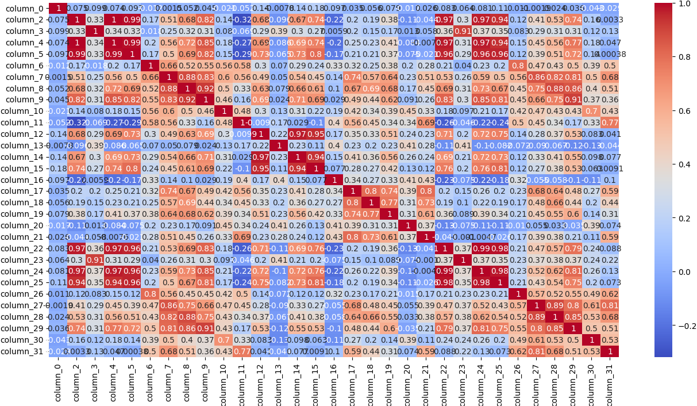

## Result of Data Visualization

Dataset has been examined through histogram analysis, boxplot analysis and correlation heatmap. And here is the results:

### Histogram Graph

First, all columns are visualized with histogram graph. The idea for histogram analysis; firstly checked per column with two classes (seperatly) to see value ranges and data counts, and then same column checked with overlay version to see how much datas are overlaps. After all columns are visualized, observed per column for how much that column able to seperated two class (malignant or benign). Or how much they are overlap. Result of this:
- Column number 2, 4, 8, 9, 22, 24, 25 are the most seperators. 
- Column number 0, 6, 13, 16, 18, 19, 20, 21 are the less seperators

### Boxplot Graph

Second, all columns visualized with Boxplot graph. Aimed with this boxplot graph to see how much far two classes medians from eachothers. 

How much medians and IQR far from eachothers that much this column have a power for separeting. After observation the results are:

- Column number 2, 4, 5, 22, 24, 25, 28, 29 are the most seperators. 
- Column number 0, 10, 11, 13, 16, 18, 20, 21 are the less seperators

#### What is the outliers mean for here?
- If there is less outliers: Dataset distibuted homogeneous. Distribution is stable for datas
- If there is moderate outliers: That is mostly healty for dataset.
- If there is much outliers: It can be skewed distribution, it can be large variance or dataset can be heterogeneus distribution.

Outliers doesn't mean incorrect data. Sometimes they are useful. If outliers just for one feature than it can be noisy data. From all this informations. Any feature eleminated for outliers values. It can reconsidered after model validation

### Correlation Heatmap
With correlation heatmap all features correlation score is visualized. Based on this graph corelation relationships are:

- column_2 = [column_4: 1, column_5: 0.99, column_22: 0.97, column_24: 0.97, column_25: 0.94]
- column_3 = [column_23: 0.91]
- column_4 = [column_2: 1, column_5: 0.99, column_22: 0.97, column_24: 0.97, column_25: 0.94]
- column_5 = [column_2: 0.99, column_4: 0.99, column_22: 0.96, column_ 24: 0.96, column_25: 0.96]
- column_12 = [column_14: 0.97, column_15: 0.95]
- column_14 = [column_12: 0.97, column_15: 0,94]
- column_15 = [column_12: 0.95, column_14: 0.94]
- column_22 = [column_2: 0.97, column_4: 0.97, column_5: 0.96, column_24: 0.99, column_25: 0.98]
- column_23 = [column_3: 0.91]
- column_24 = [column_2: 0.97, column_4: 0.97, column_5: 0.96, column_22: 0.99, column_25: 0.98]
- column_25 = [column_2: 0.94, column_4: 0.94, column_5: 0.96, column_22: 0.98, column_24: 0.98]

High corelation means redunancy. And redunancy will increase feature count and it can cause unecessary model complexity. So this increase potancially risk for overfitting. However we will use MLP for this project, it can less effect from multicorrelation. Since model dataset size is moderate and total number for feature not so much large; model will start with base dataset. After validation process if accuracy not enough or overfitting observerd then feature elemination will be done. 