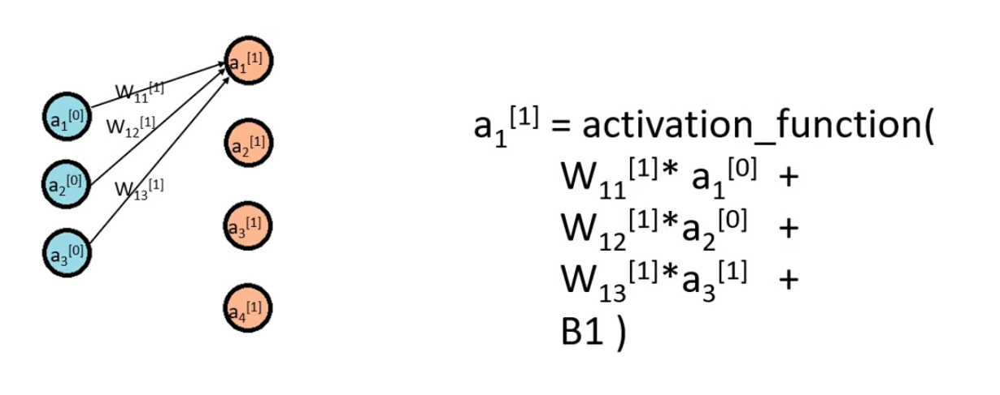
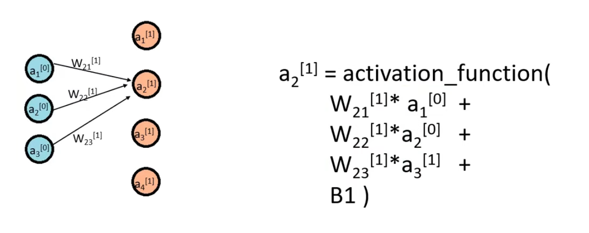
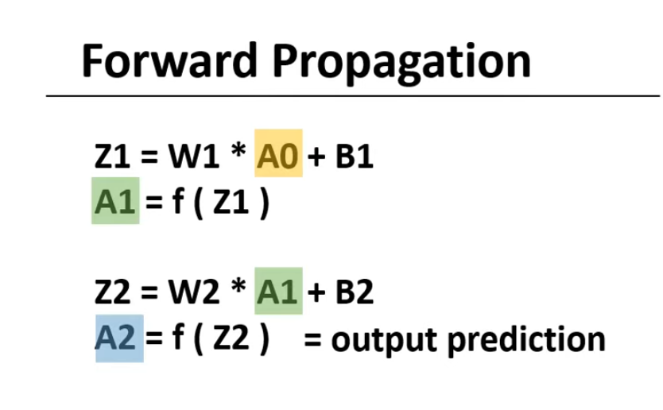
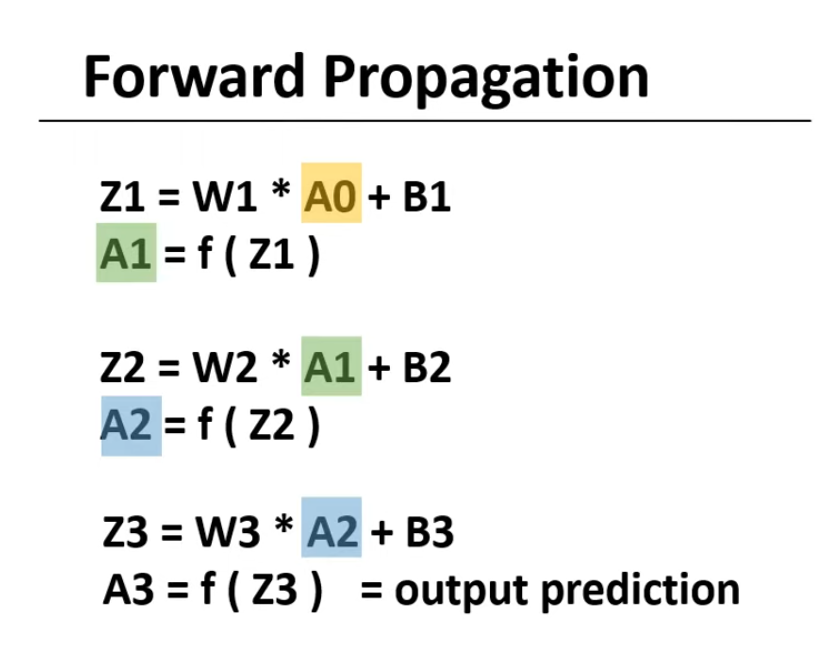
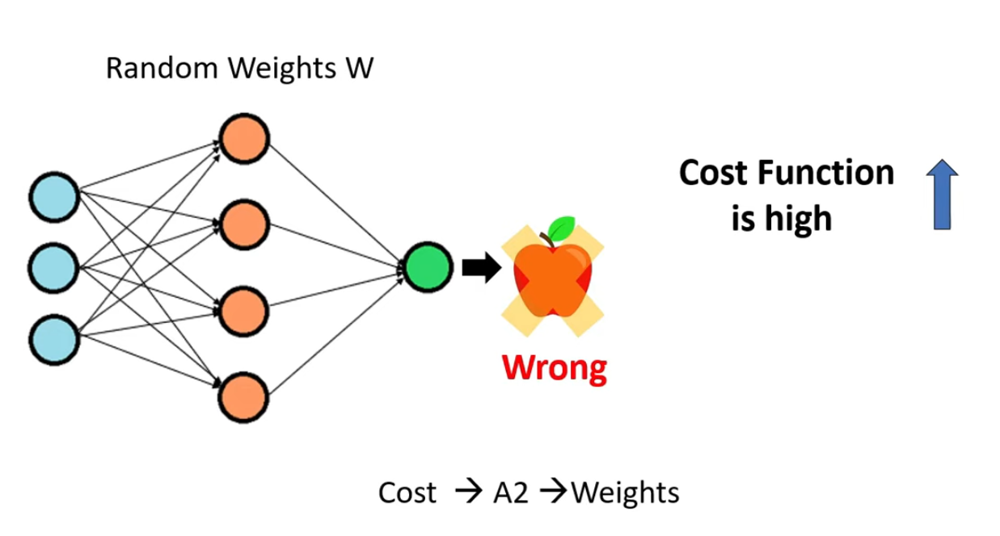
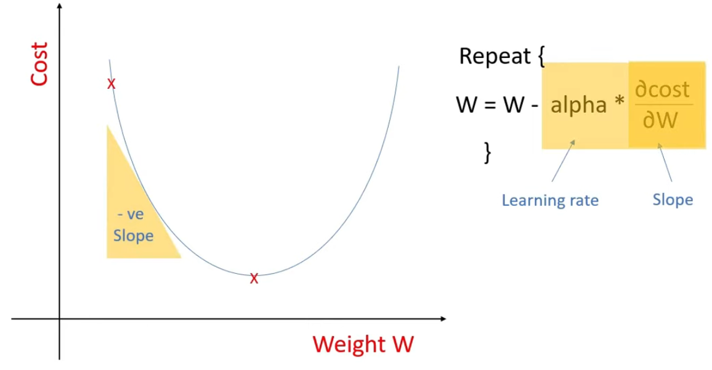
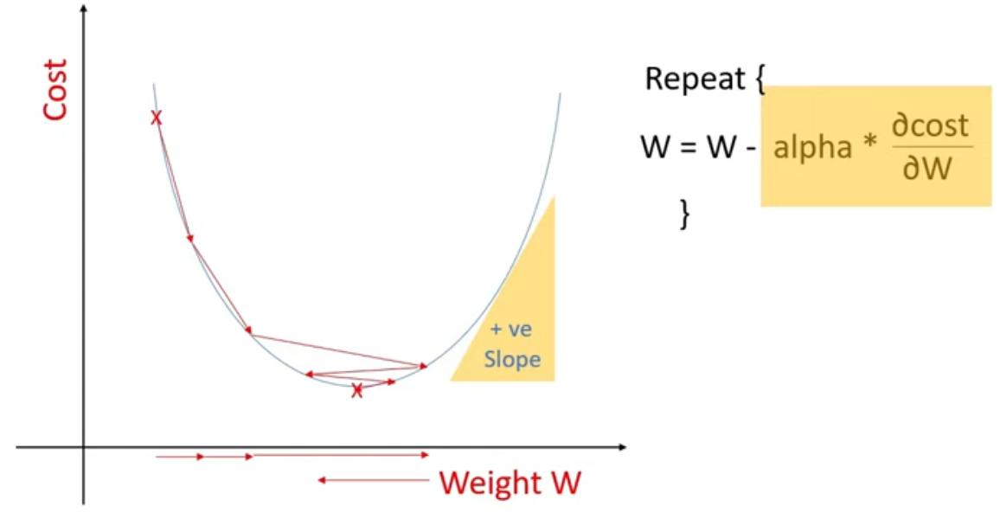
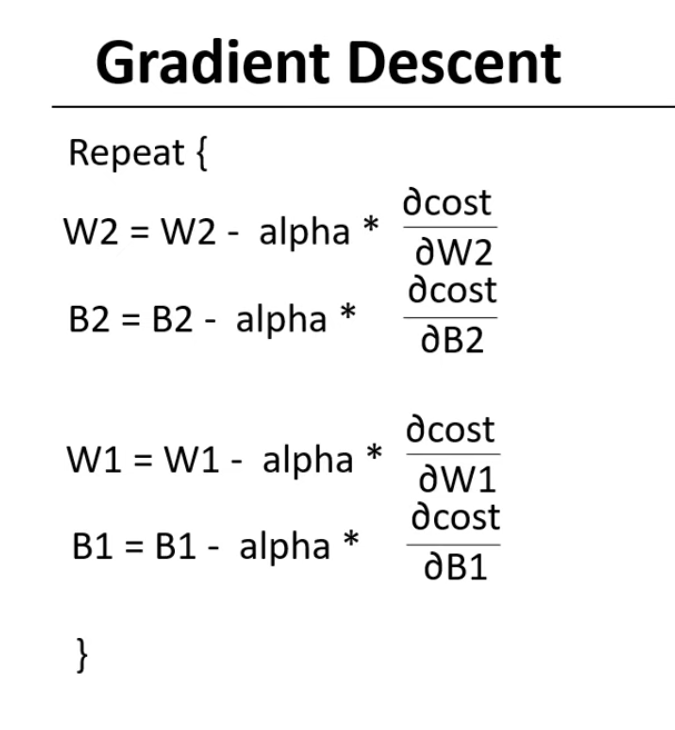
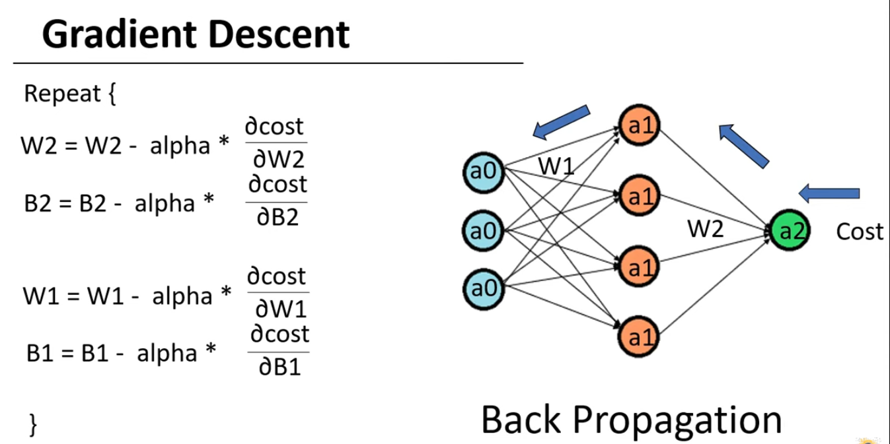
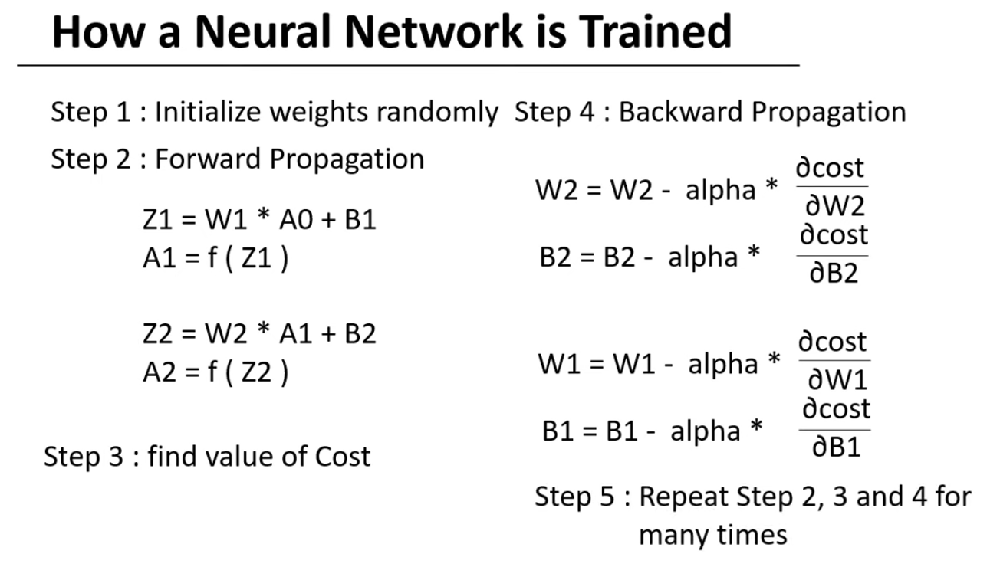

# Forward and Backword Propagation

We pass the input data from the input layer then we do the weighted sum by multiplying the weights with the neurons and then pass it to the activation function and this defines the neurons in the next layer. <strong><i>Note that these neurons are the neurons in the next layer. </i></strong>

  

<i>For a1[1] (first neuron first layer) equation W13[1] * a3[1] should be W13[1] * a3[0]. Ignore it for rest of it.</i>

<table align="center">
<tr>
</td>
<td width="60%" align="center">

</td>

<td width="50%" style="vertical-align:middle; padding-right:20px;">

The value of a1 in the first hidden layer can be calculated by multiplying these weights with the neurons in the input layer and then doing the sum and then passing it to the activation funciton.

</tr>
</table>

<table align="center">
<tr>

<td width="40%" style="vertical-align:middle; padding-right:20px;">
Similarly, to calculate the value of the second neuron, we will multiply these weights which are different the same neurons and we will again pass it to the same activation function.

</td>

<td width="100%" align="center">

</td>
</tr>
</table>

### How to calculate activations?

  

When we do matrix multiplication of these two matrices, we get the resultant matrix. We can use this, add a bias and pass it to the activation function to get the values of the neurons in the hidden layer which is our next layer. Thus, we can get the values of the neurons in the next layer with the help of this equation.

Similarly, we can get the values of the output A2 layer by this equation. Here, we are using W2 which is a weight in the next layer and A1 which is we already calculated before and B2 which is the bias. 

- These activations in hidden layers are dependent on the input we pass.
- For the different input, different neurons will be activated.
- These activated neurons affect the neurons in the next layer and then generate the output.

So we get the final output by propagating the information from the input layer to the final output layer and as we are moving forward here, we call this step as a <strong>forward propagation</strong> where we find the values of the neurons in the next layers as we propagate forward.

<table align="center">
<tr>

<td width="50%" align="center">

</td>

<td width="50%" style="vertical-align:middle; padding-left:20px;">
Where Z1 is given by this then we pass Z1 to activation functions to get the A1. Now here A0 is our input layer which is used to calculate the A1 then A1 is passed to get the Z2 and Z2 is passed to the activation function to get the final prediction.
</td>

</tr>
</table>

<table align="center">
<tr>

<td width="50%" style="vertical-align:middle; padding-left:20px;">
If we had to used 2 hidden layers then the equations would have become these where we would have passed A2 to calculate Z3 and then the A3 which will be our final prediction. <i>(We will use this equation on our project.)</i>
</td>

<td width="40%" align="center">

</td>

</tr>
</table>

## What value should these weights be?

<table align="center">
<tr>

<td width="30%" align="center">

</td>

<td width="50%" style="vertical-align:middle; padding-left:20px;">
We initialize weights randomly then we train the model and after training values of these weights will be changed in such way that i can generate a proper output predictions.

</td>

</tr>
</table>

### Cost Function

Cost function in machine learning is the error representation. And as it is the error representation, we need to minimalize the error.

For example; if we are initializing weights randomly, then our model are going to perform poor and it will give a lot wrong predictions. Thus, we can say that our cost function value is high, and as our cost function measures error of our predictions compared to the actual label it depends on our output A2 and A2 depends on weights so we need to tweak the weights in such way that our cost can be minimalized.

### Gradient Descent

<table align="center">
<tr>

<td width="50%" align="center">

</td>

<td width="50%" style="vertical-align:middle; padding-left:20px;">
When we are initalizing weights randomly, cost might take any value. So we to reach to the local minimum value. To reach there we can use these steps; derivative of cost: with respect to the parameter w (it represent the slope of the graph), learning rate (alpha): which is small positive number
</td>

</tr>
</table>

<table align="center">
<tr>

<td width="50%" style="vertical-align:middle; padding-left:20px;">
Initially we are on the left half for this slope is going to the negative thus quantity is going to be a negtive number thus we are adding going to add small value of the W thus W is going to get increased and thus the cost will decrease and it will move closer to our minima  the process will continue as long as we are on the left half.
</td>

<td width="50%" align="center">

</td>

</tr>
</table>

<table align="center">
<tr>

<td width="50%" align="center">

</td>

<td width="50%" style="vertical-align:middle; padding-left:20px;">
So W will increase more and more then we will overshoot it and we will reach on the right half.
</td>

</tr>
</table>

<table align="center">
<tr>

<td width="50%" style="vertical-align:middle; padding-left:20px;">
In the right half this slope is going to be the positive so this quantity is going to be a positive number. Thus we will substract a small quantity with the W and W will decrease. And thus we will again move closer to the local minimum value.
</td>

<td width="50%" align="center">

</td>
</tr>
</table>

The process will be repeated and eventually we will reach to the local minimum after following this couple of times. <strong>This entire process is called gradient descent algorithm.</strong>

<table align="center">
<tr>

<td width="30%" align="center">

</td>

<td width="50%" style="vertical-align:middle; padding-left:20px;">
There is so many parameter W so we need to update all of those W's. So the final gradient descent will look something like this. With all these equations we will update the values of w and b and once our weights and biases are updated, we will be able to reach the minimum cost function. Thus, we will be having the minimum error. Thus, having the better or proper output predictions.
</td>

</tr>
</table>

<table align="center">
<tr>

<td width="40%" style="vertical-align:middle; padding-left:20px;">
To find the del cost by del w, we need to use cost which depends on our final output prediction a2. And a2 will depend on the weights w2 and a1. And a1 will depend on the weights w1 and the input a0. As we need to move backword from a2 to the input layer this process is called <strong> backword propagation or back propagation </strong> and with this we will be able to update all our weights and biases thus training the model.
</td>

<td width="100%" align="center">

</td>

</tr>
</table>

## Summary

We first initialize weights randomly. Then we move forward by doing the forward propagation step. Then we will find the value of cost function to check how our model is performing. And then we perform the backword propagation algorithm to change the values or tweak the values of the parameter w and biases. Now we need to perform all these steps again. So we'll perform these steps 2, 3 and 4 many times until and eventually we reach a minimum cost function or when our all the weights and biases are trained properly so that it can generate the final output prediction.