## Why we need activation functions?

  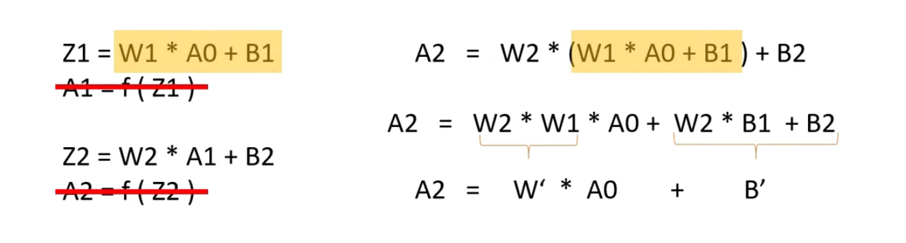

In these forward propagation equations if we skip the step of passing the z1 into the activation functions then a1 will directly be given by z1 and if we calculate a2 with this way a2 will has the same structure as a1

  

So no matter how many layers we use we will be getting the similar kind of equations and thus we will not be able to take the advantage or benefit of using the multiplier layer and it will become as just using one layer. 

Now <strong> without using any activation functions all these become linear. </strong> We need to use non-linear activation functions to take the benefit of the different hidden layers and function must be non-linear.

- Real world data is non-linear
- Learning from the complex relationship between data will be better suited with the help of non-linear activation functions.

## What are the types of activation functions?

### 1) Sigmoid Function 

Sigmoid function is an s-shaped curve and it takes any value between zero to one. For the given zero input value it gives 0.5 as the output value. Now as it only takes the value between 0 to 1 it can be interpreted as a probability if we use this in the output layer.

  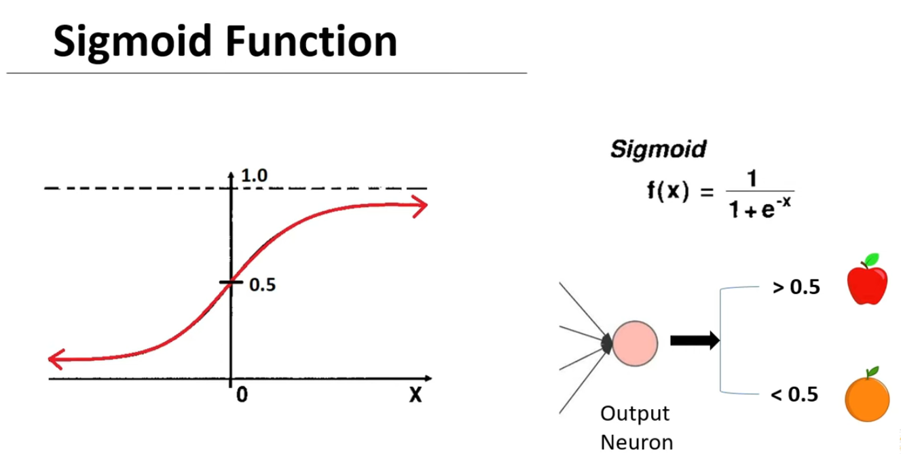

Sigmoid function is most commonly used at the output neuron in the binary classification. Let's say if we are classifying apples versus oranges and the output value is grater than 0.5 than we can classify it as an apple. If the output value is less then 0.5 then we can classify as an orange. Thus sigmoid funciton very helpful and very suitable for using it at the output layer for the binary classification. But using sigmoid function in hidden layer has some drawbacks.

### 2) Tanh Function (Hyperbolic Tangent)

<i>(Activation function for hidden layers in our project)</i>

<table align="center">
<tr>
</td>
<td width="35%" align="center">

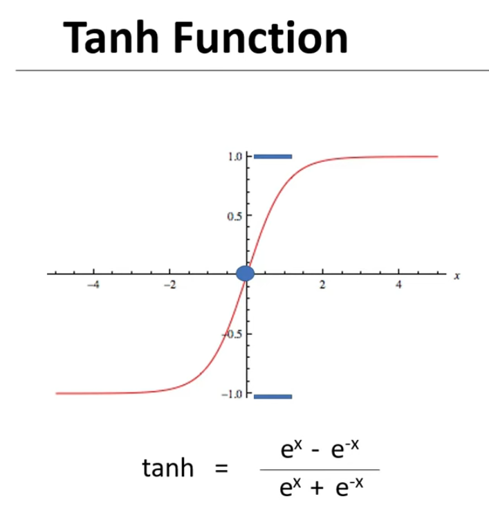

</td>

<td width="50%" style="vertical-align:middle; padding-right:20px;">

Tanh function or hyperbolic tangent function is a similar to sigmoid function just that it is stretched between -1 to 1 instead of 0 to 1. And because of this it has some advantages over sigmoid function when we use it in the hidden layer.

</tr>
</table>

<table align="center">
<tr>

<td width="35%" style="vertical-align:middle; padding-right:20px;">
In the back propagation or gradient descent we need to use derivative of cost function with respect to w. And cost function depends on the activation function so we need to take derivative of the activation function as well.
</td>

<td width="50%" align="center">
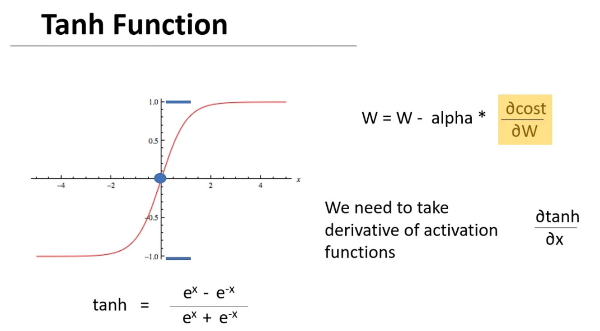

</td>
</tr>
</table>

<table align="center">
<tr>
</td>
<td width="50%" align="center">

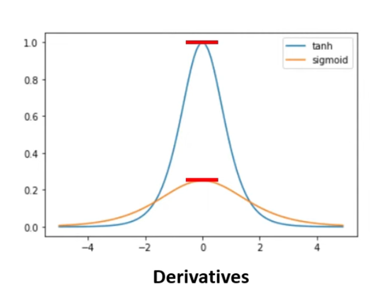

</td>

<td width="50%" style="vertical-align:middle; padding-right:20px;">

So, the maximum value of the derivative of sigmoid function is only 0.25 while that of tanh is up to 1. Thus, using tanh activation function we can train our model much faster as the derivative value is higher it will converge much more faster.

</tr>
</table>

  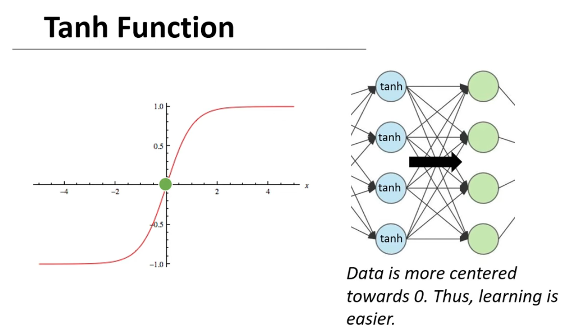

Also in tanh function the avarage of data will be close to zero and if we use tanh function in the hidden layers then it work much better then the sigmoid function. It is because of the reason that the output of the hidden layers which is also the input to the next layer will be having the values whose avarage will be close to zero or we can say that the data is normalized or centered around zero. And when we pass a normalized data to the next layer it makes the training much more easier.

### 3) ReLU (Rectified Linear Unit)

<table align="center">
<tr>
</td>
<td width="50%" align="center">

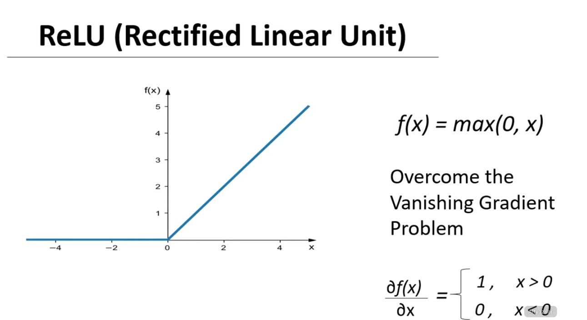

</td>

<td width="50%" style="vertical-align:middle; padding-right:20px;">

For every x less then 0 or equal to 0 it gives 0 as output. And for every x grather then 0 it gives same x as the output. 

</tr>
</table>

- As the values of derivative is same for all x grather than 0 it overcomes the vanishing gradient problem. Also its derivative value is 1 which was the maximum value of the tanh function. So also learning can be also so fast with the help of ReLU function. 
- This function is not entirely linear as it gives 0 as the output for all x less then zero while it gives linear output for all x grather than 0. So it can be also said as a piecewise linear function. It can take the advantage of both linear and non-linear property.

###  4) Variations of ReLU

  

In leakly ReLU instead of definding zero we define it with help of a very small component of x. It can be given by 0.01 multiplied by x

In ELU define it with the exponential component instead of the zero.

###  5) Softmax Function

<i>(Activation function for output layer in our project)</i>

<table align="center">
<tr>
</td>
<td width="40%" align="center">

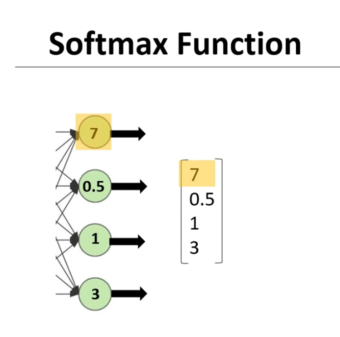

</td>

<td width="60%" style="vertical-align:middle; padding-right:20px;">

Let's say we are making the predictions for the four different classes and our final output values without the activation functions comes out to be 7, 0.5, 1, 3. Winner should be class one which is 7 in the output neuron.

</tr>
</table>

  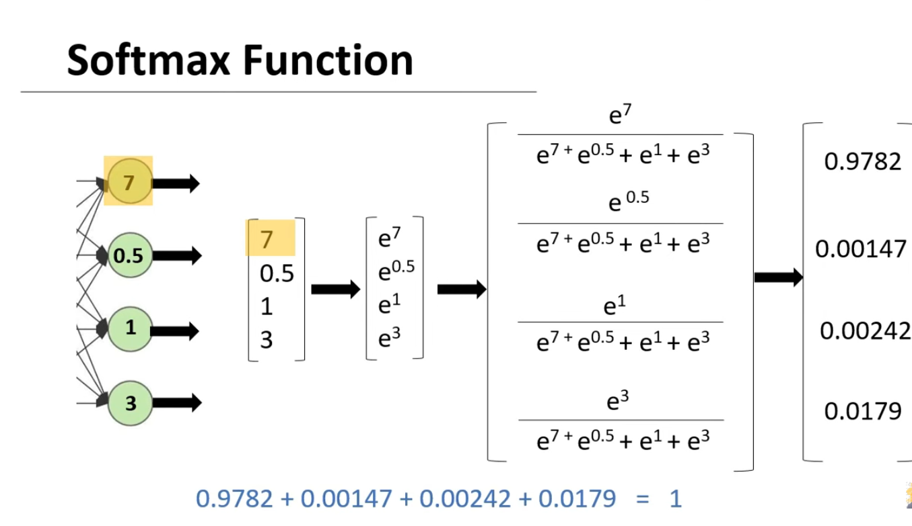

These output values can be made much better by scaling them into the probabilities. This can be achieved by calculating the exponent of each value in the list and dividing it by the sum of the exponent values. And if we do that we get the calculating values. And the summation of these values is also equal to one. Thus now we have to converted the our given output values in the form of probabilities. And we will just classify the highest probability

  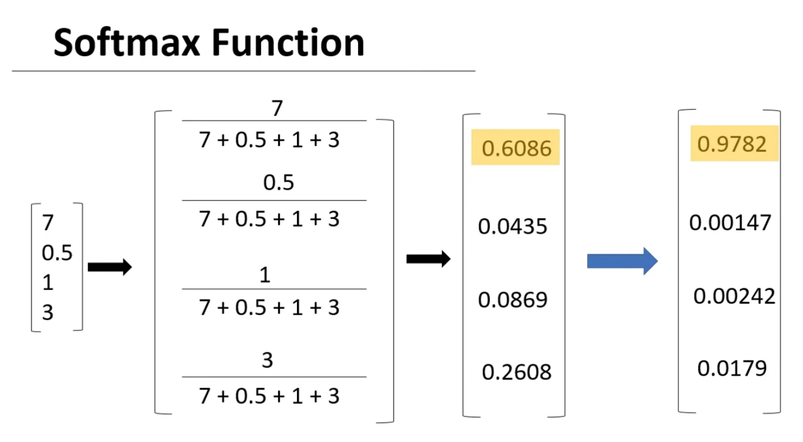

Note one thing in here we could have directly divide the values in the list with their sum and still it could have been interpreted as the probability but taking the exponent makes it much better. As the exponent function makes the larger value is larger and smaller value smaller. Thus it enhanced the final output prediction and we can be more sure of our final classification. With using exponent the output probability is 0.97 while without exponent is just only 0.6

<table align="center">
<tr>

<td width="50%" style="vertical-align:middle; padding-right:20px;">

This equation is for every eighth neurons. So we will be calculating it for every eighth neuron in the output layer while doing the multiclass classification.
</td>

<td width="50%" align="center">

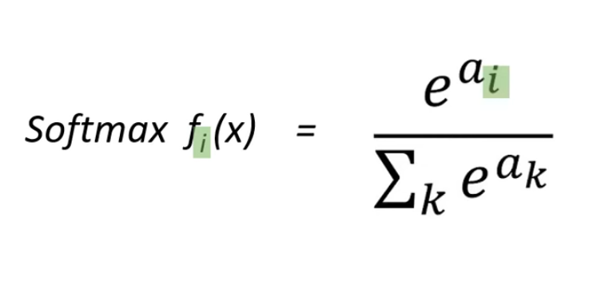

</td>

</tr>
</table>

###  6) Linear Regression

<table align="center">
<tr>

<td width="50%" align="center">

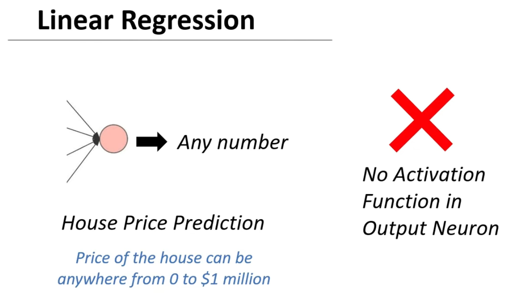

</td>

<td width="50%">
What if our final output prediction is linear and can take any value; in this case it is not usable for using any kind of non-linear activation function in the output neuron. We will be using activation functions in the hidden layers but we won't be using any activation functions in the output layer.
</td>

</tr>
</table>

