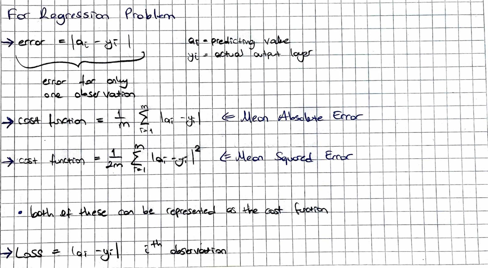
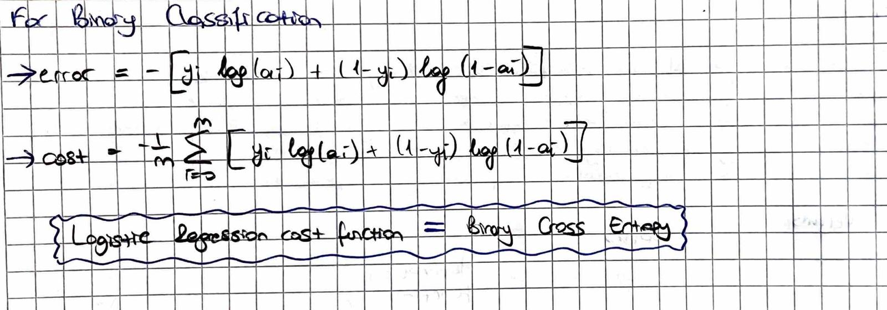
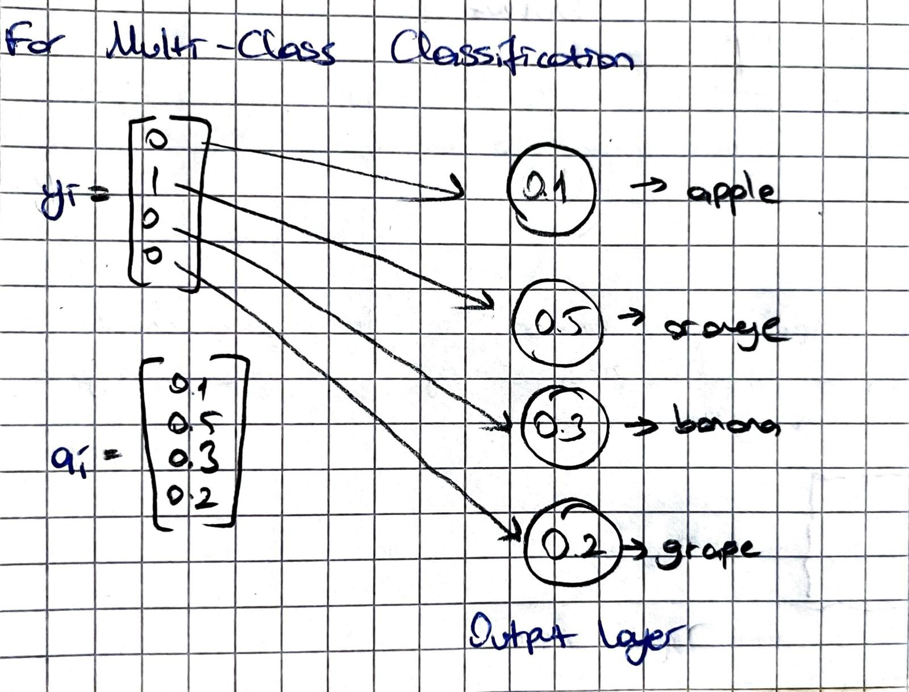
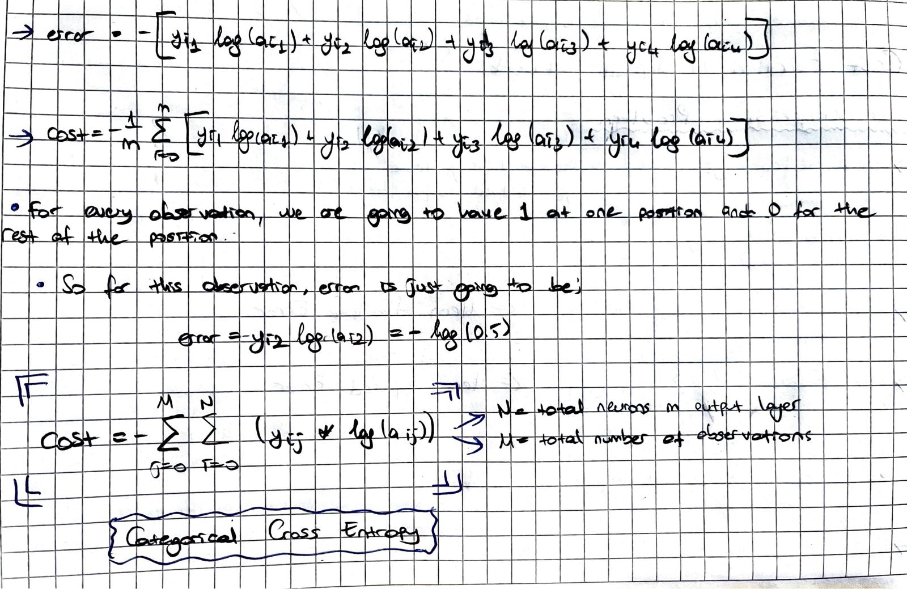
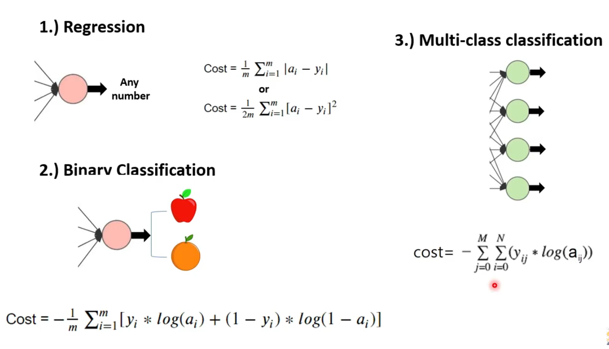

# Cost Function

Cost function in machine learning is the error representation. It shows how our model is predicting compared to the actual values or output labels.

- Lesser the cost function more the accuracy
- Higher the cost function lesser the accuracy

## Different Cost function for different types of Problems

### 1) Regression or Linear Regression

Output can take any number.

  

### 2) Binary Classification

<i>(Cost function for our project)</i>

Output can takes only 0 or 1 as its value.

  

<i>For detailed explanation for how this function work you can check https://github.com/eablak/dslr/blob/main/readme_imgs/0002.jpg</i>

### 3) Multi-Class Classification

<table align="center">
<tr>
</td>
<td width="55%" align="center">

</td>

<td width="50%" style="vertical-align:middle; padding-right:20px;">

Output can take many categories. Output label for the eighth observation are going to by given one-hot representation. One hot representation means there is a 1 at one position and 0 at the other positions.

</tr>
</table>

  

### Summarization

  

