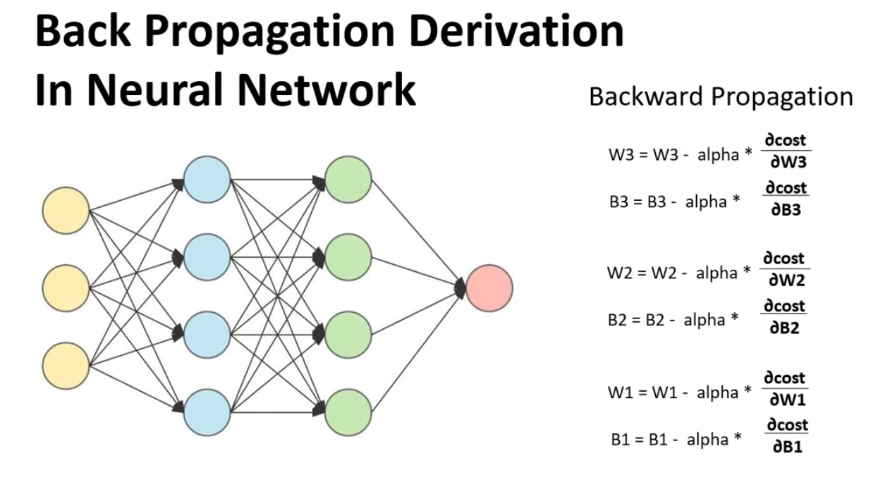
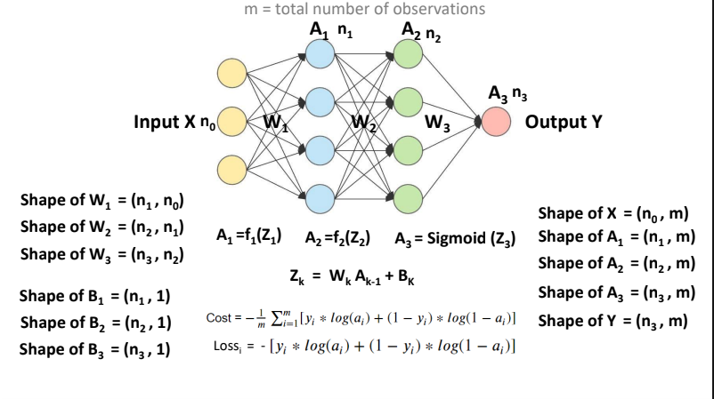
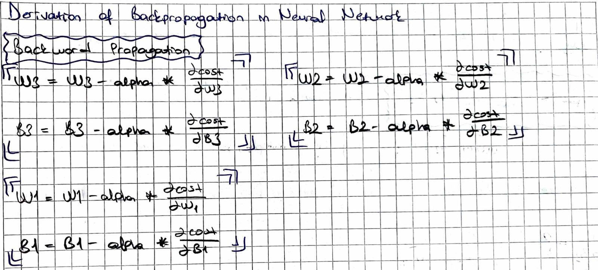
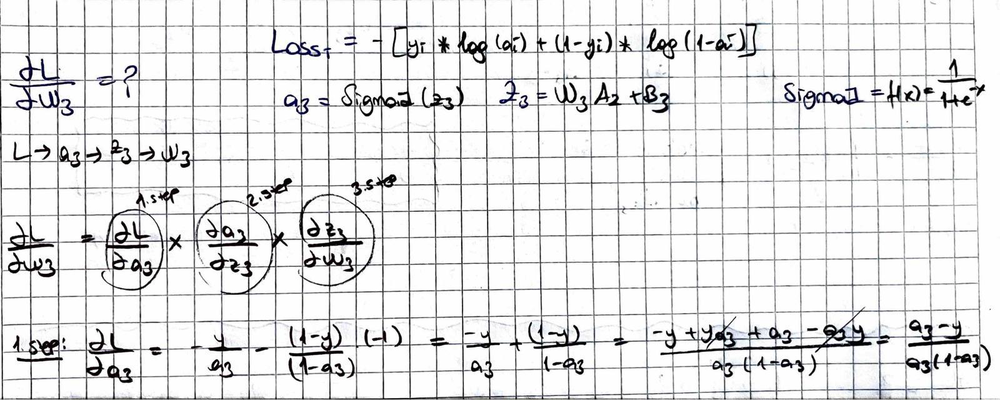
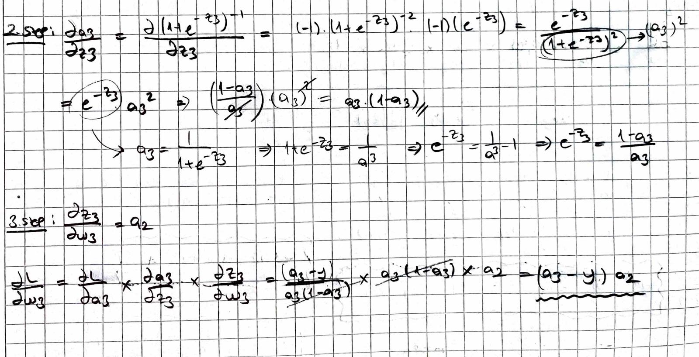
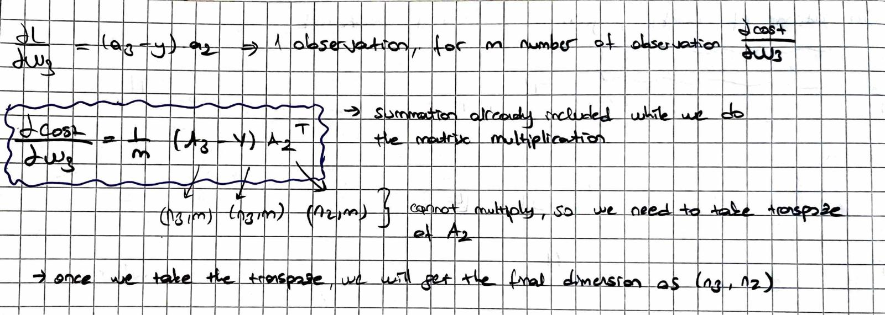
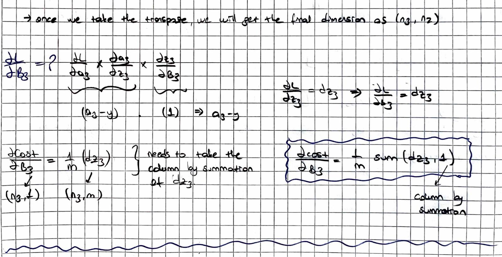
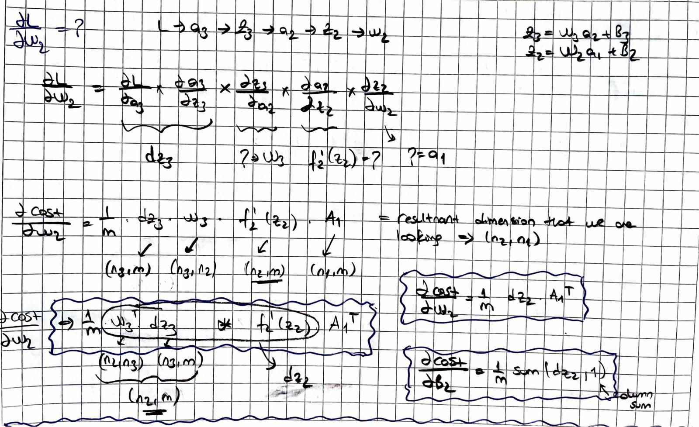
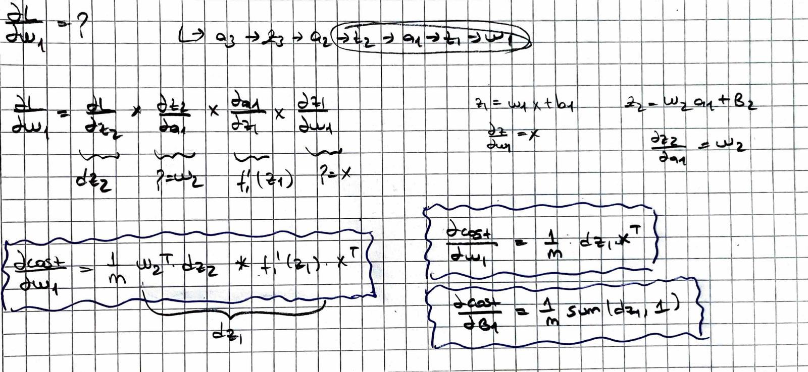
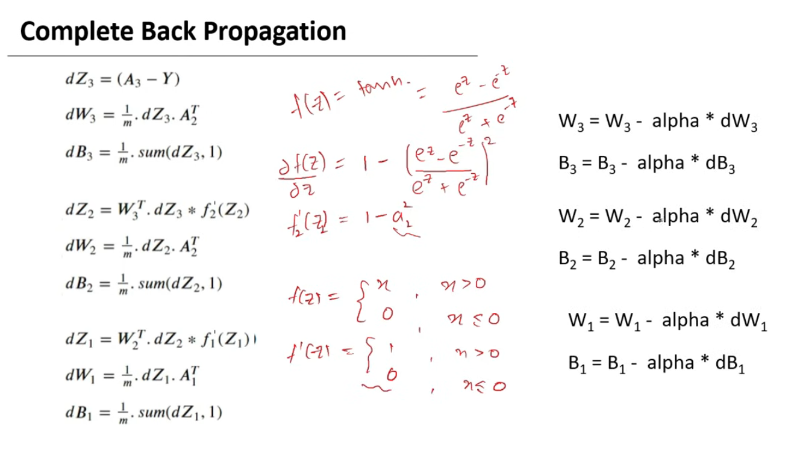

# Back Propagation Derivation of Neural Network

  

We will be deriving the equations for the back propagations for the neural network having two hidden layers.

  

- Shape of W is number of neurons in the next layer and the number of neurons in the previous layer.
- Shape of B gonna be number of current layer neurons and one.
- Shape of the input data is going to be (n0, m) where n0 are the number of features in the data and m is the number of observations.

 

  

  

  

  

  

  

  

## Summarization

  

