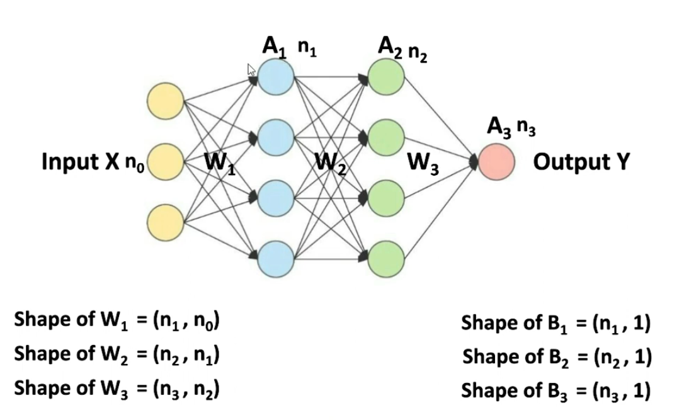
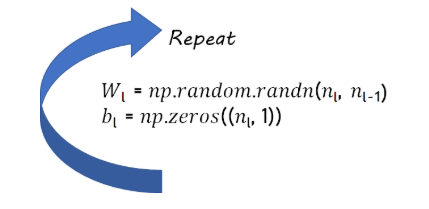
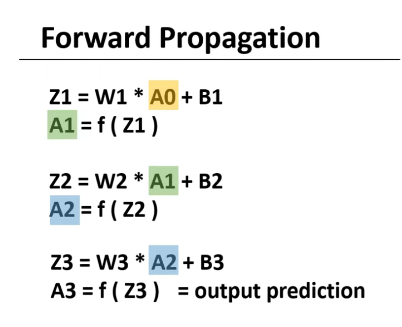
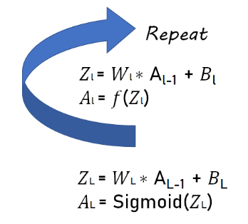
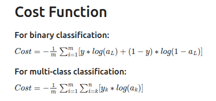
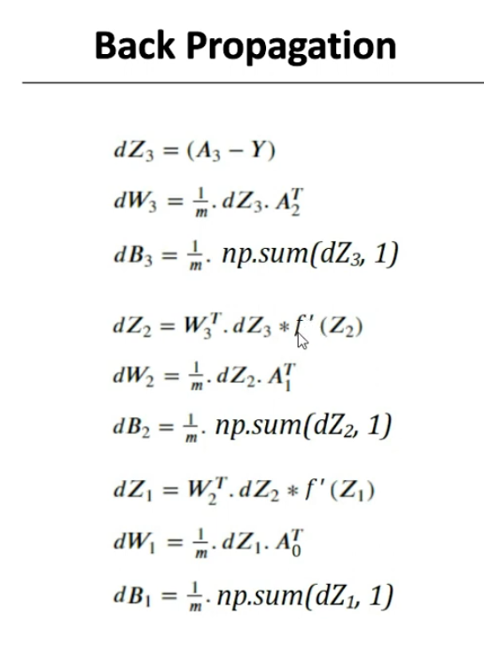
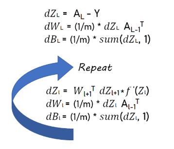
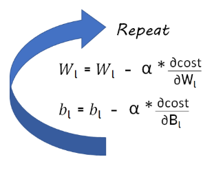

# MLP Train

## Step 1: Initialize Parameters

- We need to initialize the W parameters randomly, and B with zeros
- And as our Deep Neural network has L layers, we will repeat it for L-1 times, from Wl to  (not considering the input layer)

<table align="center">
<tr>
<td align="center">

</td>
<td align="center">

</td>
</tr>
</table>

## Step 2: Forward Propagations

Softmax activation function will be used only at the last (output) layer, while we will use ReLU for hidden layers.

<table align="center">
<tr>
<td align="center">

</td>
<td align="center">

</td>
</tr>
</table>

For f(x), you can use either tanh or ReLU activation function. But also use the derivative of the same for Backpropagation as well.

## Step 3: Cost Function

<table align="center">
<tr>
<td align="center">

</td>
</tr>
</table>

## Step 4: Backward Propagation

- For last layer, dZL will be AL - Y
- Except for last layer, we use a loop to implement backprop for other layers

<table align="center">
<tr>
<td align="center">

</td>
<td align="center">

</td>
</tr>
</table>

## Step 5: Update Parameters

  

## Complete Model

We need to initialie parameters once, and after that, we will run the following a loop:

- forward_prop(x, parameters)
- cost_function(aL, y)
- backword_prop(x, y, parameters, forward_cache)
- parameters = update_parameters(parameters, gradients, learning_rate)