# Understanding what is Neural Networks?

<table align="center">
<tr>
<td width="50%" style="vertical-align:middle; padding-right:20px;">

Artificial neural network work: We feed a set of input data and based on this input data the network will recognize patterns in it and make output predictions for new data.

</td>
<td width="50%" align="center">

</td>
</tr>
</table>

## For Example

<table align="center">
<tr>

<td width="50%" style="vertical-align:middle; padding-right:20px;">
If we pass a set of apple and orange images into the network, the network will try to recognize patterns inside these images.
</td>

<td width="50%" align="center">
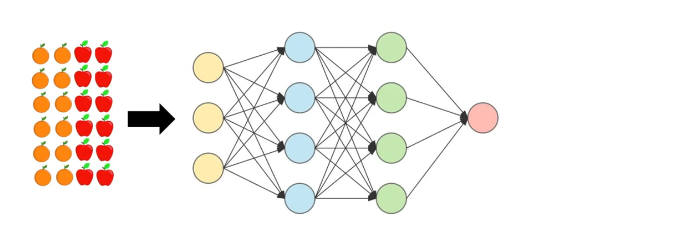
</td>

</tr>
</table>

---

<table align="center">
<tr>

<td width="50%" style="vertical-align:middle; padding-right:20px;">
The network will then try to recognize patterns stored inside these images.
</td>

<td width="50%" align="center">
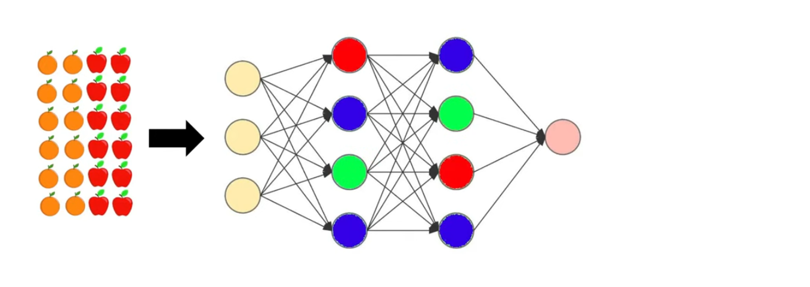
</td>

</tr>
</table>

---

<table align="center">
<tr>

<td width="50%" style="vertical-align:middle; padding-right:20px;">
Based on the learned patterns, it will make predictions for new images that it has never seen before.
</td>

<td width="50%" align="center">
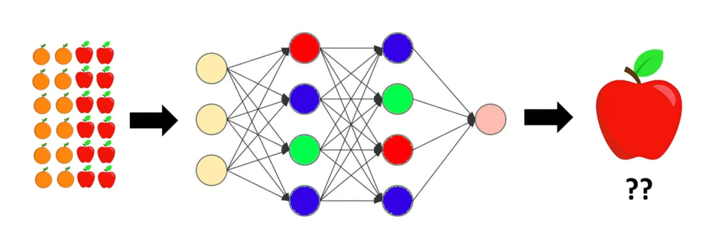
</td>

</tr>
</table>

# What is neuron?

<table align="center">
<tr>

<td width="50%" align="center">

</td>

<td width="50%" style="vertical-align:middle; padding-left:20px;">
A neuron is a function that produces an output value. This output value can be anything, but it is usually small and between 0 and 1.
</td>

</tr>
</table>

 

<table align="center">
<tr>

<td width="50%" align="center">

</td>

<td width="50%" style="vertical-align:middle; padding-left:20px;">
Different neurons store different values inside them, and these different values are responsible for recognizing different patterns in different regions.
</td>

</tr>
</table>
 
## For example

There may be some neurons which hold some numbers that are responsable for recognizing red color in an image of apple. And there maybe some other neurons for recognizing orange color in the image of orange.

  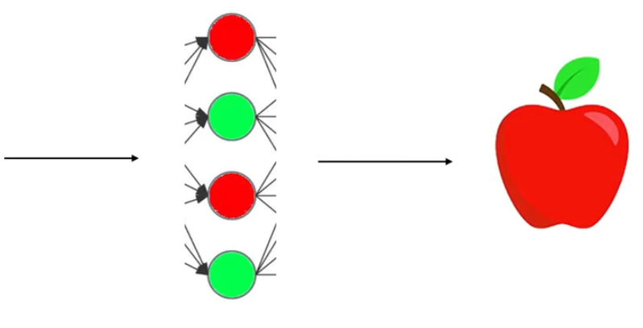
  

So when we feed an image of apple some neurons get activated and when we feed an image of an orange other neurons will get activated!

Due to these activations on neurons **we can also call these neurons as activations** and as these are the functions **we can call them activation functions.**

  
  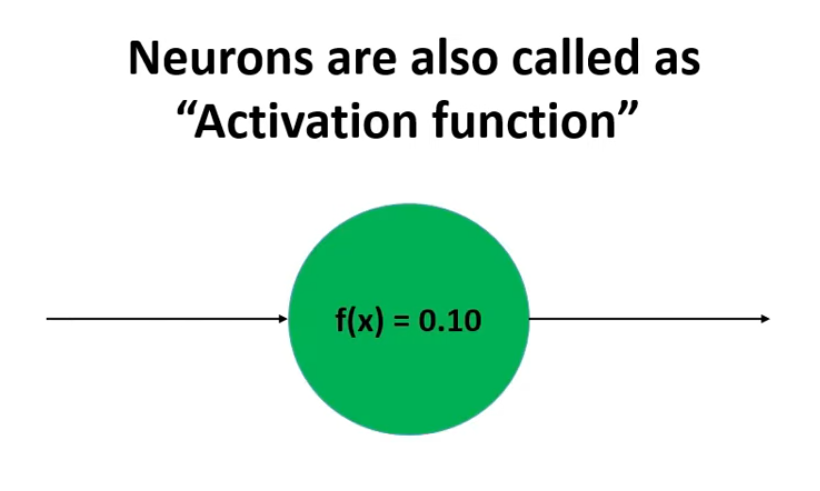

Collection of these neurons forms layers. A neural network is divided into three types of layers: input layer, hidden layer and output layer.

  

<table align="center">
<tr>

<td width="50%" align="center">

</td>

<td width="50%" style="vertical-align:middle; padding-left:20px;">
Input layer has the neurons which holds the value from the dataset. So number of neurons in the input layer will be equal to the number of features we have in our input data.</td>

</tr>
</table>

<table align="center">
<tr>

<td width="50%" style="vertical-align:middle; padding-left:20px;">
On this final output can only can be an apple or orange. Thus the output layer will have one neuron. Which holds a value between 0 to 1 showing the probability of an image an being apple or an orange.</td>

<td width="50%" align="center">

</td>

</tr>
</table>

<table align="center">
<tr>

<td width="35%" align="center">
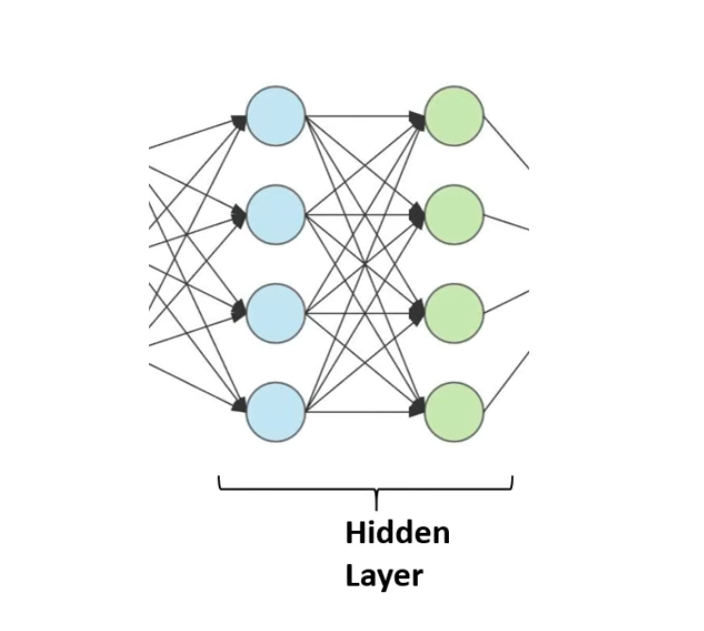
</td>

<td width="50%" style="vertical-align:middle; padding-left:20px;">
The hidden layers are responsable for holding a patterns in them.
</td>
</tr>
</table>

- It is possible here that first layer is responsible for finding the shape of the content of the image
- And second layer might be recognizing the color in the central region. And some neurons will be activated for red color while the other with orange.

### Connection between every pair of neurons are called weights

There is one connection between every two pair of the neurons and we assign a weight value to every pair of the two neurons. We call them weights because they determine how much weight should we be puttin or how much emphasis should be given to a certain region or certain patterns that we recognizing.

<table align="center">
<tr>

<td width="60%" align="center">
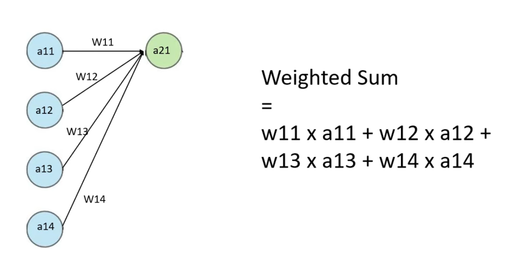
</td>

<td width="50%" style="vertical-align:middle; padding-left:20px;">
This can be done with weighted sum. Weighted sum is when we multiply every wieght within every value of the neuron and take itself.</td>
</tr>
</table>

<table align="center">
<tr>

<td width="50%" style="vertical-align:middle; padding-left:20px;">
Let's say this neuron responsible for recognizing the color in the central region of the image. Now our wighted sum will be high if the color in the central region in the image now our weighted sum will be high if the color in the central region of the image is red. Thus our network will be confident about having the presence of an apple in the image instead of orange.</td>
<td width="50%" align="center">
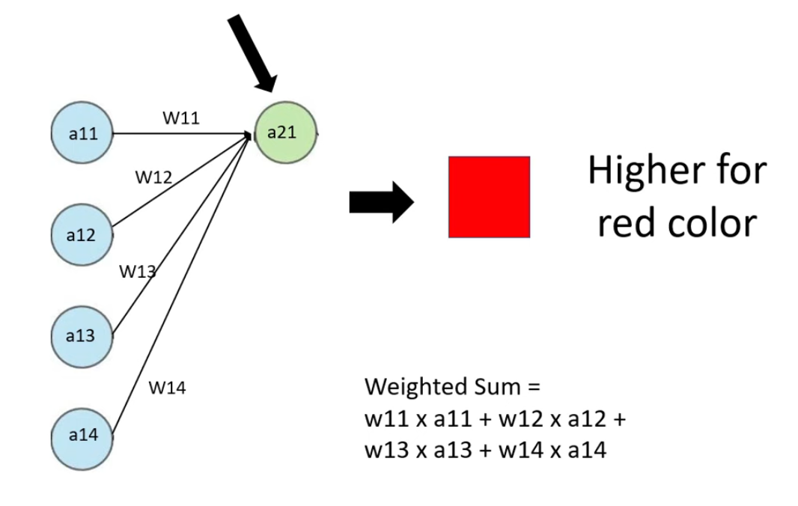
</td>
</tr>
</table>

<table align="center">
<tr>

<td width="60%" align="center">
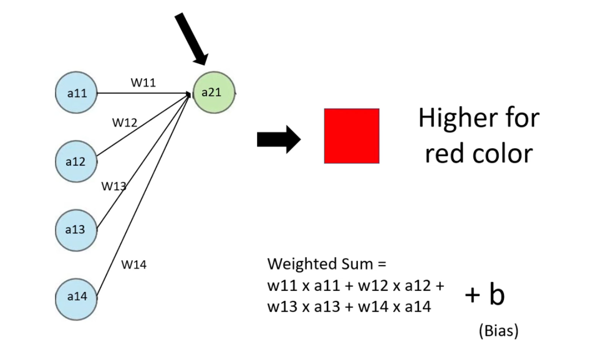
</td>

<td width="50%" style="vertical-align:middle; padding-left:20px;">
We need to add another parameter called bias. <strong>This bias value determines how high weighted sum should be.</strong> If the b(bias) value is negative then our weighted sum will be less but if this value is high positive number then our weighted sum will be high.
</td>

</tr>
</table>

<table align="center">
<tr>

<td width="60%" align="center">
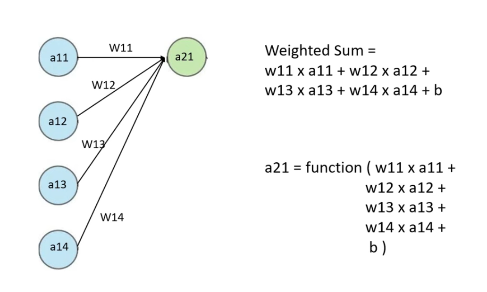
</td>

<td width="50%" style="vertical-align:middle; padding-left:20px;">
Now this <strong>weighted sum will passed to the activation function which gives proper output value a single small output value.</strong> This output value only gives the exsistence of a neuron. So a21 will be output value after passing the weighted sum to the activation function.

</td>

</tr>
</table>

<table align="center">
<tr>

<td width="60%" align="center">
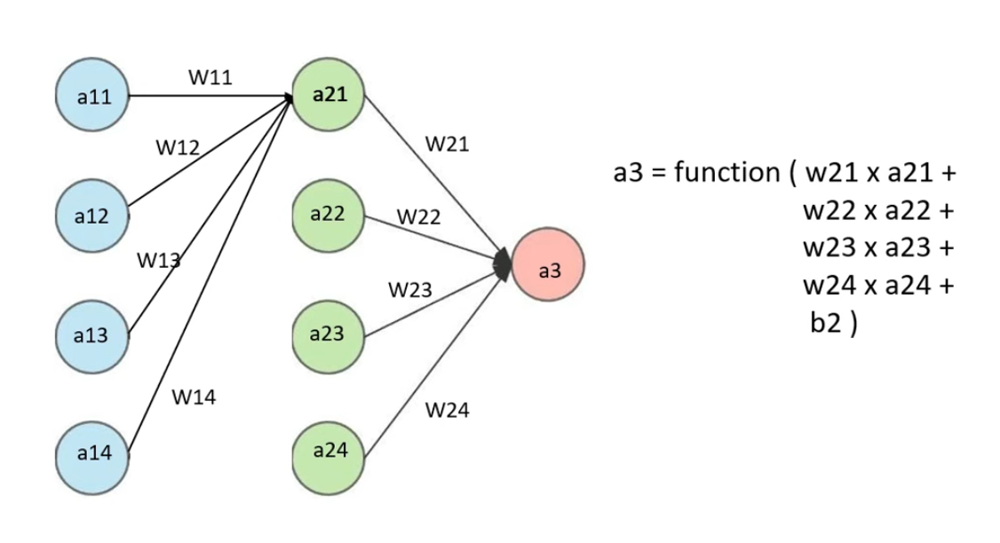
</td>

<td width="50%" style="vertical-align:middle; padding-left:20px;">
This neurons will again be mutliplied with the weights to calculate the weighted sum for the next layer and <strong> process will be repeated until and eventually the final output prediction.</strong>
</td>

</tr>
</table>

### How to train the weights?

<table align="center">
<tr>

<td width="50%" style="vertical-align:middle; padding-left:20px;">

We first initialize random values for this weights and then we train our model after the model is trained it will automatically change the values of the weight to give the proper output prediction.
</td>

<td width="50%" align="center">
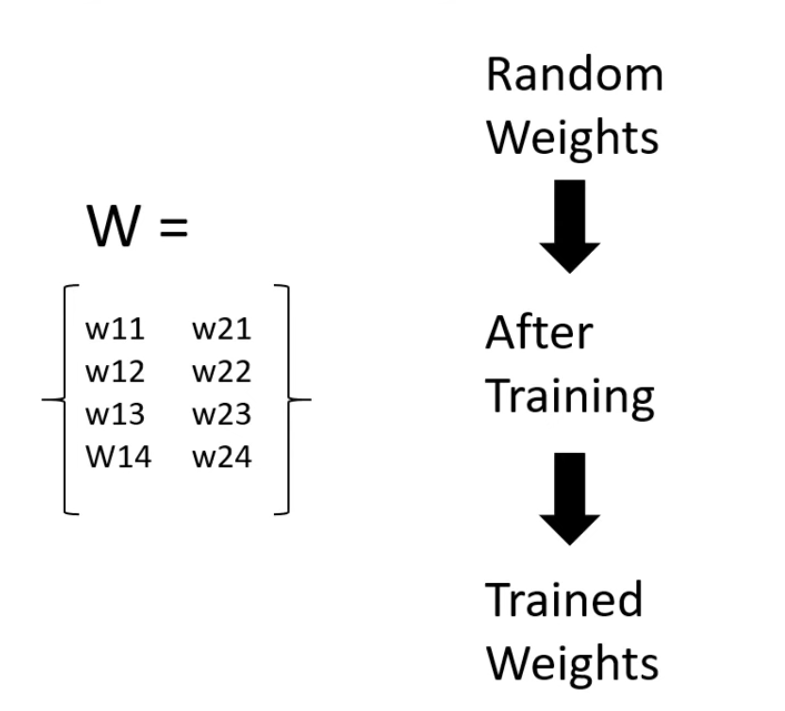
</td>

</tr>
</table>

# What about our Multilayer Perceptron Project?

## Multilayer Perceptron

The multilayer perceptron is a feedforward network (meaning the data flows from the input layer to the output layer) defined by the presence of one or more hidden layers, as well as an interconnection of all the neurons of one layer to the next.

  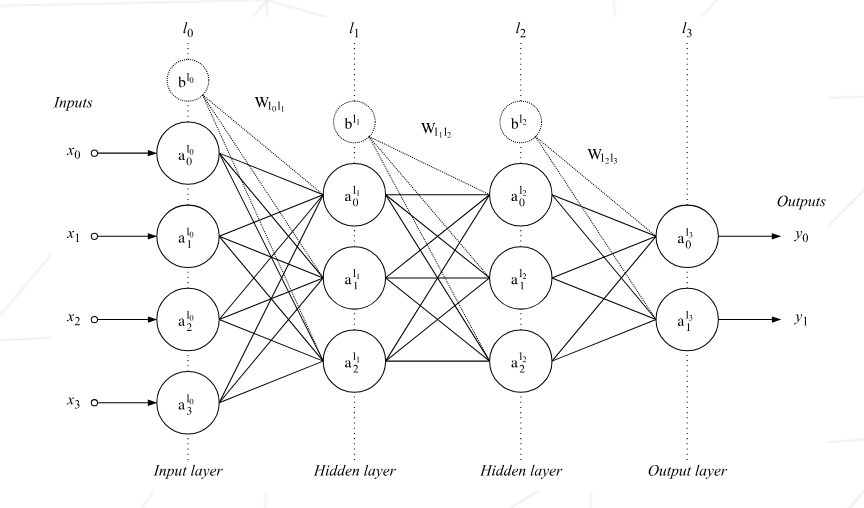

The diagram above represent a network containing 4 dense layers (also called fully connected layers). Its inputs of 4 neurons and its outputs consist of 2 (perfect for binary classification). The weights of one layer to the next layer are represented by two dimensional matrices noted W lj lj+1. The matrix W l0l1 is of size (3,4) for example, as it contains the weights of the connections between layer l0 and layer l1.

The bias is often represent as a special neuron which has no inputs and an output always equal to 1. Like a perceptron, it is connected to all the neurons of the following layer (the bias neurons are noted b lj on the diagram). The bias is generally useful fo as it allows one to "control the behavior" of a layer.

The project requires <i>"your neural network implementation must contain at least two hidden layers by default".</i> Since our dataset has 31 features and 569 samples it is relativly small. Therfore i prefer to use only two hidden layer with 16 and 8 neurons. The layer structure will be <strong> 31 -> 16 -> 8 -> 2</strong>. This means the total number of parameters will be:

- 31 x 16 = 496
- 16 x 8 = 128
- 8 x 2 = 16
- 26 bias

So, in total the network will have <strong>666 parameters.</strong>

## Perceptron

The perceptron is type of neuron that the multilayer perceptron is composed of. It is defined by the presence of one or more input connections, an activation function, and a single output. Ecanh connection contains a weight (also called parameter) which is learned during the training phase.

  

Two steps are necessary to get the output of neuron. The first one consist in computing the weighted sum of the previous layer with the weights of the input connections of the neuron which gives

  

The second step consist in applying an activation function on this weighted sum. The output of this function is the output of the perceptron and can be understood as the treshold above which the neurons is activated.